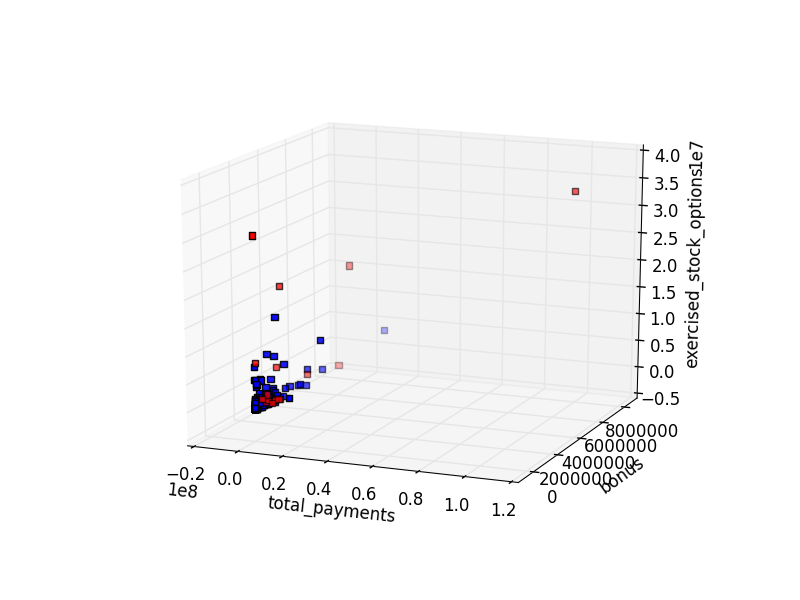

# <center> Fraud Detection: Enron Dataset</center>

## <center> Joby John, 02/16/2016 </center>

<pre>1. Summarize for us the goal of this project and how machine learning is useful in trying to accomplish it. As part of your answer, give some background on the dataset and how it can be used to answer the project question. Were there any outliers in the data when you got it, and how did you handle those?  [relevant rubric items: “data exploration”, “outlier investigation”]</pre>

We are given a dataset (a dictionary) of people with their names as 'keys' and a bunch of financial and email features. They are also identified as being a Person Of Interest (poi) or not. The goal is to train a supervised machine learning algorithm that can idenitfy whether or not a person ins a poi given the financial and email features alone and provide a *precision* and *recall* of over 0.3. 

#####Why Machine Learning
There are many features (14 financial and 7 email) makes this an intractable problem to just plot figures to figure out clusters or identify trends that separate poi's from non-poi's. The fact that we have labels idetifying the poi's from the non-poi's makes this a problem suited for supervised machine learning. Technically we could also use an unspervised approach (like a k-means with k=2), but such an approach is not appropriate as it would be be tantamount to throwing away information in the case of this particular dataset where we know if a person is a poi or not. 


#####Data Exploration:
The dictionary has 146 entries. Of these, one is the TOTAL which is addressed below. 
There are 18 poi's and the rest 127 are non-poi's. As mentioned before we have 14 financial and 7 email features.

* Many of the financial features have more than 50% missing values:
    * deferral_payments (73% vamissing values are missing);
    * 'loan_advances' (97% missing values)    
    * 'restricted_stock_deferred' (85% missing values)
    * 'deferred_income' (66% missing values)
    * 'long_term_incentive' (54% missing values)
    * 'director_fees' (88% missing values)
This is indicating that these features would have poor predicitve power and should not be considered.    

##### Outliers:
To check if there are outliers is an important step if one is performing regression or support vector machine (svm) based classification as the outliers can greatly affect the outcome of the classifier. For a decision tree, for example, this does not impact as much, as the algorithm functions on information-gain based splitting and will not be affected by the distance of one point from the mean of the data. The primary method used for detection of outliers was plotting the data in 2 and 3 dimensions (plot_features.py). It was observed that the TOTAL entry in the dictionary is an outlier and therefore needs to be removed (using data_dict.pop('TOTAL',0))

Two other employees are also removed for very high bonuses. LAY KENNETH L, SKILLING JEFFREY K.  

To spot an outlier, once the plot is made, the approximate value of the outlier is estimated and then the dictionary is checked iteratively to find all the keys that meet the condition (i.e. choose keys with feature greater than relevant value.)



<pre><code>What features did you end up using in your POI identifier, and what selection process did you use to pick them?   
</code></pre>

####The features that were used (in the best performing DecisionTree) along with feature_importances    
   
1. 'total_stock_value', 0.0187664
4. 'expenses', 0.14192093
5. 'exercised_stock_options', 0.12212516
6. 'other', 0.15013123
7. 'restricted_stock', 0.07819769 
9. 'shared_receipt_with_poi',  0.21464075
10. 'Topoi2frm', 0.16603503 (Newly introduced feature )
11. 'poi_mail_ratio' 0.1081828  (Newly introduced feature)

####The features that were used (in the best performing SVM) with $\chi^2$ score:
1.  'bonus', 1.83493206e+00 
2.  'total_stock_value', 2.45619681e+00
3.  'expenses', 1.36882835e+00 
4.  'exercised_stock_options', 2.64265719e+00
5. 'shared_receipt_with_poi', 1.76833959e+00  
6. 'Topoi2frm',  3.91460933e+00
7. 'bon2sal', 2.31739139e+00
The $\chi^2$ score statistic and the associated p-values are a measure if the feature and the outcome (i.e. poi/non-poi) are independent. If there is no enough evidence for the independence, then chances are that the feature selected could actually predict the outcome. It was possible to use this measure also because all features are  positive quantities (as required) and all of the chosen features have a p-value less than 1.5e-1 for the statistic.

<pre>In your feature selection step, if you used an algorithm like a decision tree, please also give the feature importances of the features that you use, and if you used an automated feature selection function like SelectKBest, please report the feature scores and reasons for your choice of parameter values.  [relevant rubric items: “create new features”, “properly scale features”, “intelligently select feature”]</pre>  
The newly engineered features have already been shown above. 
####The feature selection process involved the following steps:
1. Using intuition to guess if variables like "other" and "from_messages" alone can affect the classifier (and confirming this intuition with following steps)
2. Seeing how much information content is there in each feature (if the number of NaN values was greater than 50 % of the cases then that feature was not used)
3. Plotting the features (see plot_features.py): Checking for outliers and making sure enough poi's are represented by the feature. If the data had a non-Nan value only for a couple of poi's it was ruled out (e.g. )
4. Using a criterion like **selectKBest**  for SVM (based on $\chi^2$ score) or **feature_importance** for DecisionTree to choose different number of features and for each case assessing the performance as determined by tester.py. The final choice was based on F1-score , i.e, the number of features that maximized f1-score as determined by tester.py.  

<pre>Did you have to do any scaling? Why or why not?</pre>    
SVM's are sensitive to the scale of the data (i.e. scale of the different features) and since we are combining two different classes of features (financial and email) it is necessary to scale the features so that they can be compared in a consistent manner. Also, the newly introduced features are all ratios and hence by definition are between 0 and 1. It then becomes necessary to use a min-max scaler. Other approaches like DecisionTree and Adaboosted-DecisionTree did not need scaled features. However the scaled features were used in testing these algortihms also. It is important to note that the *fit* of the *scaling* is done on training data and in the tester.py the same scaler is used. See line 26 in tester.py:  
<code>data = scaler.transform(featureFormat(dataset, feature_list, sort_keys = True))</code>

<pre>As part of the assignment, you should attempt to engineer your own feature that does not come ready-made in the dataset -- explain what feature you tried to make, and the rationale behind it. (You do not necessarily have to use it in the final analysis, only engineer and test it.)</pre>  
####Some of the features that were introduced/engineered:
1. **'bon2sal'** The ratio of bonus to salary. 
    If someone receives a high bonus relative to his salary, it could indicate some hanky-panky.
2. **'stock2sal'** The ratio of stocks to salary.
    Same logic as above, inordinatesly high stock to salary ratio could be suspicious.
3. **'Topoi2frm'** Ratio of mails from a person to the poi to the total number of mails sent.
    If the person is sending too many emails to the poi relative to the total emails he sends out, it could imply that they are also a poi. It is necessary to normalize the emails sent out so that we can compare two subjects with completely different email volumes.
4. **'frmpoi2To'** Ratio of mail from a poi to a person to the total number of mails received.
    Same reason as the above feature. More emails coming in from a poi can indicate the recepient is also a poi. 
5. **'poi_mail_ratio'** Ratio of total number of mail to and from a poi to the total number of mails to and from a person.
    This feature is also designed using the same reason as above. But instead of using the To and From emails separately, here the ratio of all emails to and from a poi to the total emails to and from a person is considered. This is the feature that finally helped meet the performance criterion (0.3 precision and recall).
6. **'is_enron_emp'**: weather or not a person is an enron employee
    It is observed from the data that all poi's have an *@enron.com* email address. So it is safe to say that if some one is not an enron employee, he is not a poi. The hope was that adding this feature will bring down the number of False Positives and hence bring up the precision.   

<pre><code>What algorithm did you end up using? What other one(s) did you try? How did model performance differ between algorithms?  [relevant rubric item: “pick an algorithm”]
What does it mean to tune the parameters of an algorithm, and what can happen if you don’t do this well?  How did you tune the parameters of your particular algorithm? (Some algorithms do not have parameters that you need to tune -- if this is the case for the one you picked, identify and briefly explain how you would have done it for the model that was not your final choice or a different model that does utilize parameter tuning, e.g. a decision tree classifier).  [relevant rubric item: “tune the algorithm”]</code></pre>
 
Both the DecisionTree and SVM were able to meet the required critertion of precision and recall>0.3. However the Decision Tree gave the best precision and recall after the right number of features were provided as input. See **Model Performance** below.

Every algorithm has a set of parameters. These are typically regularization constants, soft margin parameters, kernel free parameters, etc. We want to tune or choose the set of parameters that perform well on training data to improve the performance of the algorithm based on some performance metric (accuracy, precision, recall, f1-score etc). But if we do not validate the tuned parameters on a separate test data we run the risk of *over-tuning* and can cause *overfitting* on the training data. 

The parameters in the Support Vector Classifier are C and gamma (for *rbf* kernel). They are tuned using the GridSearchCV function which essentially trains a SVM on every possible outcome of the paramter combinations and returns the combination that maximizes some performance metric. In our case, since we want to maximize both precision and recall, **'f1'** score (the harmonic mean of precision and recall) is chosen as the metric to be maximized in GridsearchCV. We find that C=5e4 and gamma = 0.1 are the best parameters for this dataset with this performance metric. 

####Model Performance
#####Decision Tree Performance
\# of Features 8:  Accuracy: 0.85680       Precision: 0.46060      Recall: 0.43250 **F1: 0.44611**     F2: 0.43784  
\#of Features 11:  Accuracy: 0.83553       Precision: 0.37289      Recall: 0.34250 F1: 0.35705     F2: 0.34818  
\#of Features All: Accuracy: 0.81067       Precision: 0.28283      Recall: 0.27350 F1: 0.27809     F2: 0.27532  

##### SVM Performance
\#of Features 7: Accuracy: 0.83014       Precision: 0.39418      Recall: 0.35200 **F1: 0.37190**     F2: 0.35970  
\#of Features 9: Accuracy: 0.82893       Precision: 0.38746      Recall: 0.34000 F1: 0.36218     F2: 0.34854  
\#of Features 10: Accuracy: 0.82093       Precision: 0.34323      Recall: 0.27750 F1: 0.30688     F2: 0.28855   
\#of Features 8:  Accuracy: 0.82836       Precision: 0.38209      Recall: 0.32650 F1: 0.35212     F2: 0.33629      

    What is validation, and what’s a classic mistake you can make if you do it wrong? How did you validate your analysis?  [relevant rubric item: “validation strategy”]
Crossvalidation or just validation is a method of using separate "test" data to test the valdity of the model trained on the training data. It provides a reliable estimate (a lower bound) of the performance of the trained classifier out in the "wild" on completely new data. 

If we don't validate our model, we run the risk of overfitting. i.e. we can tune the parameters such that it fits the training data very well but the model will not generalize on untested data and will return poorer performance compared to the training data.

In this project, in addition to the testing using a StratifiedShuffleSplit in tester.py, validation is also done by splitting the data in to a test set and training set and also using a stratified k-fold validation. 

<pre><code>Give at least 2 evaluation metrics and your average performance for each of them.  Explain an interpretation of your metrics that says something human-understandable about your algorithm’s performance. [relevant rubric item: “usage of evaluation metrics”]</code></pre>
    
Used both *precision* and *recall*.
**Precision** is the ratio of True Positive(TP) to True Positive + False Positive (TP+FP); i.e. it tells us how often the algorithm labels a non-poi as a poi (i.e. FP's). The higher the precision, the fewer false positives are being detected by the algorithm.

**Recall** is the ratio of TP to (True Positive (TP)+False Negative(FN)); i.e. it tells us how often the classifier misses to catch a true poi (i.e. FN). 

With a precision of, say, 0.3, the number of True Positive (i.e. detection of a poi who is actually a poi) was only 30% of all cases *deteceted* as poi's. 

The alogorithm erroenously classifies a lot of people who are actually poi's as not poi's. (i.e there are quite a few False Negatives). With a *recall* (or sensitivity) of 0.3, the number of True Positives detected was about 30 % of all the cases that are actually poi's.

In this problem, both precision and recall are required to be greater than 0.3. There were some cases of SVM parameters that lead to a high precision (0.57) and high accuracy (87%) but in these cases recall suffered and fell to around 0.1. There is a tradeoff between precision and recall and we need to find parameters that maximize both metrics. For this we used the **f1** score which is the harmonic mean of precision and recall. 

Here we cannot use accuracy as a good measure of our performance because, the number of poi's to non-poi's is 18 to 127. By calling every one a non-poi we would have an error rate of less than 15%; clearly this algorithm does not accomplish much and hence accuracy is generally not a good idea when the ratio of positive cases to negative cases (or vice versa) is imabalanced.


```python

```
